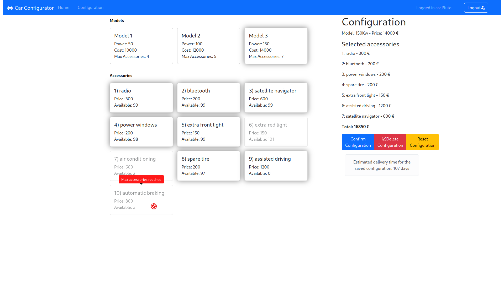

[](https://classroom.github.com/a/Hg0Z37PI)
# Exam #2: "Car Configurator"
## Student: s331476 SCIRPOLI SIMONE 

## React Client Application Routes

- Route `/`: Home page, shows a static list of models and accessories
- Route `/login`: Login form, allows the user to login. After a successful login, the user is redirected to the home page (`"/"`)
- Route `/configuration`: only if logged, shows the list of models and accessories becomes dynamic, 
allowing the user to select a model and add accessories to it. If a configuration is already saved, it is loaded and the user can manage it.
- Route `*`: Page for nonexisting URLs (Not Found page) that redirects to the home page with a button.


## API Server

- GET `/api/models`
  - **Response body**:  a JSON object with the list of models
  ```json
    [ {"model_id": 1, "power": 150, "cost": 10000, "maxAcc": 4}, ...]
    ```
  - Codes: `200 OK`, `500 Internal Server Error`


- GET `/api/accessories`
  - **Response body**: a JSON object with the list of accessories
    ```json
      [ {"accessory_id": 1, "name": "radio", "price": 300, "quantity": 100, "needed_id": null, "incompatible_id": null }, ...]
      ```
  - Codes: `200 OK`,`500 Internal Server Error`


- GET `/api/configuration`
    - **Response body**: a JSON object with the model and the list of accessories in the configuration or an empty object. Authentication is needed to access this route.
        ```json
         {"user_id": 1, "model_id": 1, "accessories": [1,2]}
        ```
    - Codes: `200 OK`, `401 Not Authorizated`, `500 Internal Server Error`


- POST `/api/configuration`
  - **Request**: a JSON object with the configuration. Authentication is needed to access this route. Validation is performed to check if the configuration is valid.
      ```json
       {"user_id": 1, "model_id": 1, "accessories": [1,2]}
      ```
  - **Response body**: a JSON object with the configuration just saved 
  - Codes: `201 Created`,`400 Invalid Configuration`, `401 Not Authorizated`, `500 Internal Server Error`


- PUT `/api/configuration`
  - **Request**: a JSON object with the new configuration to load. Authentication is needed to access this route. Validation is performed to check if the configuration is valid.
      ```json
       {"user_id": 1, "model_id": 1, "accessories": [1,2]}
      ```
  - **Response body**: a JSON object with the configuration just updated 
  - Codes: `200 OK`,`400 Invalid Configuration`, `401 Not Authorizated`, `500 Internal Server Error`

- DELETE `/api/configuration`
  - **Request**: authenticated request to delete user's configuration
  - Codes: `200 OK`, `400 No configuration`, `401 Not Authorizated`, `500 Internal Server Error`


### Authentication APIs

* **POST `/api/sessions`**: Authenticate and login the user.
  - **Request**: JSON object with the user's email (username) and password:
    ```
    { "username": "a@gmail.com", "password": "pwd" }
    ```
  - **Response body**: JSON object with the user's info and, if the user is a good client, name; or a description of the errors:
    ```
    { "user_id": 1, "email": "a@gmail.com", "name": "Pluto", "good": 1}
    ```
  - Codes: `200 OK`, `401 Unauthorized` (incorrect email and/or password), `400 Bad Request` (invalid request body), `500 Internal Server Error`.

  

* **GET `/api/sessions/current`**: Get info on the logged in user.
  - Codes: `200 OK`, `401 Unauthorized`, `500 Internal Server Error`.
  - **Response body**: JSON object with the same info as in login:
    ```
    { "user_id": 1, "email": "a@gmail.com", "name": "Pluto", "good": 1}
    ```

* **DELETE `/api/sessions/current`**: Logout the user.
  - Codes: `200 OK`, `401 Unauthorized`.

### Authorization API

* **GET `/api/auth-token`**: Returns an auth token the logged in user.
  - Response body: JSON object with token
  - Token payload: `{ "user_id": 1, "good": 1 }`
  - Codes: `200 OK`, `401 Unauthorized`.

## API Server2

* **POST `/api/estimation`**: Estimate time for the configuration
  - Request Header: JWT token with good param
  - Request body: JSON object with the list of accessories' name
    ```
    { "accessories":  ["radio", "bluetooth"]}
    ```
  - Response body: JSON object with the estimated time or an error object
      ```
      { "time": 10 }
      ```

## Database Tables
- Table `models` - **model_id**, power, cost, maxAcc
- Table `accessories` - **accessory_id**, name, price, quantity
- Table `users` - **user_id**, name, email, good, hash, salt
- Table `configurations` - **user_id**, model_id 
- Table `accPerConf` - **user_id, accessory_id**
- Table `incompatibleAccessories` - **id_1, id_2**
- Table `accNeedAcc` - **current_id**, needed_id


## Main React Components
- `AppWithRouter` (in `App.jsx`): the main component that, rendered inside a `BrowserRouter` to be able to navigate between the different routes
- `StaticLayout` (called in `Layout.jsx`): shows the static tables with models and accessories
- `Login` (in `Login.jsx`): shows the login form
- `ConfigurationLayout` (in `Layout.jsx`): a wrapper to the `TableLayout` and `SummaryLayout`.
  - `TableLayout` (in `Configuration.jsx`): shows the dynamic tables with models and accessories
    - `ModelLayout` create a table of selectable `ModelElement` cards
    - `AccessoriesLayout` create a table of selectable `AccessoryElement` cards
  - `SummaryLayout` (in `Summary.jsx`): shows the summary of the configuration with the selected elements

- `models` (in `App.jsx`): store the list of models fetched from the server
- `accessories` (in `App.jsx`): store the list of accessories fetched from the server
- `configuration` (in `App.jsx`): store the (database) configuration of the user
- `selectedModel` and `selectedAccessories` (in `App.jsx`): store the selected model and accessories (temporary, client-side)

## Screenshot



## Users Credentials

- a@gmail.com - pwd
- b@gmail.com - pwd
- c@gmail.com - pwd
- d@gmail.com - pwd
- e@gmail.com - pwd


